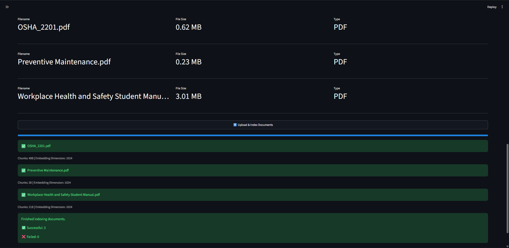
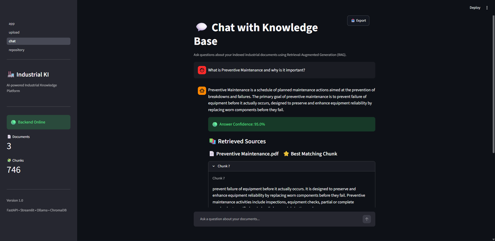
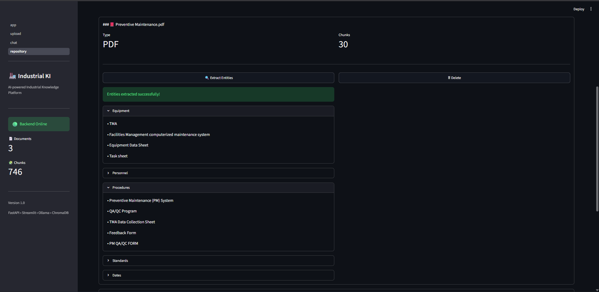

# Industrial Knowledge Intelligence Platform


An end-to-end AI-powered Industrial Knowledge Intelligence Platform that enables organizations to upload, index, search, and interact with technical documents using Retrieval-Augmented Generation (RAG) powered entirely by local AI models.

The platform supports heterogeneous industrial documents, OCR for scanned PDFs, semantic search, conversational question answering, confidence scoring, and source-aware responses while keeping all processing local using Ollama and ChromaDB.
---

## Table of Contents

- Problem Statement
- Features
- Tech Stack
- Installation
- Backend API
- Project Architecture
- Project Structure
- Progress
- End-to-End Workflow
- Why Local AI
- Screenshots
- Key Highlights
- Project Status
- Future Enhancements
- What I Learned
- License
  
---

## Problem Statement

Industrial organizations manage thousands of documents such as operating procedures, maintenance manuals, inspection reports, safety guidelines, and technical documentation. Finding accurate information quickly is difficult because these documents are often distributed across multiple systems and formats.

This project aims to build an intelligent AI platform that indexes industrial documents, performs semantic search, and answers user questions using Retrieval-Augmented Generation (RAG).

---

## Features

### Document Ingestion

- ✔ Multi-document upload
- ✔ Drag-and-drop interface
- ✔ Batch processing
- ✔ Camera capture support
- ✔ Multiple document formats

  
**Supported Document Formats**

- PDF
- DOCX
- PPTX
- XLSX
- CSV
- TXT
- PNG
- JPG
- JPEG

  
### Intelligent Parsing

- ✔ Native PDF parsing
- ✔ OCR for scanned PDFs
- ✔ Automatic OCR fallback
- ✔ Mixed PDF support
- ✔ Metadata extraction
 
### AI Processing Pipeline

- ✔ Document chunking using a sliding window approach

- ✔ Local embedding generation using Ollama (`mxbai-embed-large`)

- ✔ Batch embedding generation

- ✔ Persistent vector storage with ChromaDB

- ✔ Metadata-preserving document indexing

- ✔ Semantic similarity search

### Retrieval-Augmented Generation

- ✔ Conversational chat
- ✔ Context retrieval
- ✔ Local LLM inference
- ✔ Context-aware answers
- ✔ Retrieval confidence score
- ✔ Source citations
- ✔ Document grouping
- ✔ Relevance scoring

### Search Features

- ✔ Semantic similarity search
- ✔ Cross-document retrieval
- ✔ Multi-document indexing
- ✔ Best matching chunks
- ✔ Grouped document citations

### Frontend

- ✔ Streamlit UI
- ✔ Sidebar navigation
- ✔ Upload page
- ✔ Chat page
- ✔ Chat history
- ✔ Suggested questions
- ✔ Confidence indicator
- ✔ Repository explorer
- ✔ Source visualization
- ✔ Document statistics
---

## Tech Stack

### Backend

- Python
- FastAPI
- Pydantic

### Embedding Model

- mxbai-embed-large:latest 

### Large Language Model

- llama3.1:8b  

### Vector Database

- ChromaDB

### OCR

- Tesseract OCR
- pdf2image
- Pillow

### Document Processing

- PyMuPDF
- python-docx
- python-pptx
- openpyxl

### Frontend

- Streamlit
- streamlit-option-menu

### AI Techniques

- Sentence Embeddings
- Retrieval-Augmented Generation (RAG)
- Semantic Search

---

## Installation

Follow the steps below to set up and run the Industrial Knowledge Intelligence Platform locally.

### 1. Clone the Repository

```bash
git clone https://github.com/Yash-Raj-Ravi/industrial-knowledge-intelligence
cd industrial-knowledge-intelligence
```

### 2. Create a Virtual Environment

**Windows**

```bash
python -m venv .venv
.venv\Scripts\activate
```

**Linux / macOS**

```bash
python3 -m venv .venv
source .venv/bin/activate
```

### 3. Install Dependencies

Install the backend dependencies:

```bash
pip install -r requirements.txt
```

Install the frontend dependencies:

```bash
pip install -r frontend/requirements.txt
```

### 4. Install and Start Ollama

Download and install Ollama from:

https://ollama.com/download

Start the Ollama server:

```bash
ollama serve
```

### 5. Download the Required AI Models

Embedding model:

```bash
ollama pull mxbai-embed-large:latest
```

Large Language Model:

```bash
ollama pull llama3.1:8b
```

### 6. Install OCR Dependencies (Optional)

To enable OCR support for scanned PDFs and image-based documents:

- Install **Tesseract OCR**
- Install **Poppler**

Ensure both are added to your system PATH or configured in `backend/config.py`.

### 7. Run the Backend API

```bash
uvicorn backend.main:app --reload
```

The FastAPI server will start at:

```
http://127.0.0.1:8000
```

Interactive API documentation:

```
http://127.0.0.1:8000/docs
```

### 8. Run the Streamlit Frontend

Open a new terminal, activate the virtual environment, and run:

```bash
streamlit run frontend/app.py
```

The frontend will be available at:

```
http://localhost:8501
```

### 9. Start Using the Platform

1. Upload one or more supported industrial documents.
2. Generate embeddings to index the uploaded documents.
3. Open the Chat page.
4. Ask questions about your indexed documents using Retrieval-Augmented Generation (RAG).

---

## Backend API

| Method | Endpoint | Description |
|--------|----------|-------------|
| `GET` | `/` | Health check endpoint to verify that the API is running. |
| `POST` | `/upload` | Upload a supported document to the server. |
| `POST` | `/parse` | Parse an uploaded document and extract its text content. |
| `POST` | `/chunk` | Split a document into overlapping text chunks for processing. |
| `POST` | `/embed` | Generate embeddings for document chunks and index them in ChromaDB. |
| `POST` | `/extract-entities` | Extract named entities from an indexed document. |
| `POST` | `/search` | Perform semantic similarity search across indexed documents. |
| `POST` | `/ask` | Answer user queries using Retrieval-Augmented Generation (RAG). |
| `GET` | `/documents` | Retrieve the indexed document repository and metadata. |
| `DELETE` | `/documents/{document_id}` | Delete a document and its associated embeddings from the repository. |
| `POST` | `/reset` | Reset the ChromaDB vector database *(development utility)*. |


The platform exposes RESTful APIs for document ingestion, semantic indexing, entity extraction, repository management, and Retrieval-Augmented Generation (RAG).


## Project Architecture

```text
             
                          User
                           │
                           ▼
                  Streamlit Frontend
                  ├──────────────────┐
                  ▼                  ▼
         Upload Documents       Ask Question
                  │                  │
                  ▼                  ▼
          Document Parsing    Query Embedding
                  │                  │
        ┌─────────┴─────────┐        │
        ▼                   ▼        ▼
   Native Parsing      OCR (if needed)
                  │
                  ▼
             Text Chunking
                  │
                  ▼
      Batch Embedding Generation
                  │
                  ▼
           ChromaDB Vector Store
            │                 │
            │                 ▼
            │          Semantic Search
            │                 │
            ▼                 ▼
     Entity Extraction   Retrieved Context
            │                 │
            ▼                 ▼
   Structured Entities    Ollama LLM
            │                 │
            └──────────┬──────┘
                       ▼
      Confidence + Source Citations
```

---

## Project Structure

```text

industrial-knowledge-intelligence/
│
├── .venv/
│
├── backend/
│   ├── chunking/
│   ├── core/
│   ├── embedding/
│   ├── llm/
│   ├── models/
│   ├── parsers/
│   ├── services/
│   ├── utils/
│   ├── vectorstore/
│   ├── __init__.py
│   ├── config.py
│   └── main.py
│
├── chroma_db/
│
├── docs/
│   └── learning_journal.md
│
├── frontend/
│   ├── components/
│   │   └── sidebar.py
│   │
│   ├── pages/
│   │   ├── 1_upload.py
│   │   ├── 2_chat.py
│   │   └── 3_repository.py
│   │
│   ├── utils/
│   │   └── chat_export.py
│   │
│   ├── api.py
│   ├── app.py
│   ├── config.py
│   └── requirements.txt
│
├── uploads/
│
├── .gitignore
├── CHANGELOG.md
├── README.md
└── requirements.txt

> **Note:** The `uploads/` and `chroma_db/` directories are created automatically at runtime and are excluded from version control via `.gitignore`.
```

---

## Progress

### Completed

- ✔ FastAPI backend
- ✔ Streamlit frontend
- ✔ Multi-format upload
- ✔ Multi-document upload
- ✔ OCR support
- ✔ Camera capture
- ✔ Multi-format parsing
- ✔ Chunking
- ✔ Local embeddings
- ✔ ChromaDB
- ✔ Semantic search
- ✔ RAG pipeline
- ✔ Conversational AI
- ✔ Confidence scoring
- ✔ Source citations
- ✔ Suggested questions

---

## End-to-End Workflow

1. Upload one or more industrial documents.
2. Documents are parsed based on their format.
3. OCR is automatically invoked for scanned PDFs or image-based documents while searchable PDFs are parsed directly.
4. Text is divided into overlapping chunks.
5. Each chunk is converted into embeddings using Ollama.
6. Embeddings are stored in ChromaDB.
7. User submits a question through the chat interface.
8. Relevant chunks are retrieved using semantic similarity.
9. Retrieved context is passed to the local LLM.
10. The generated response is displayed with:
    - Confidence score
    - Source citations
    - Relevance scores
    - Grouped document references

---

## Why Local AI?

This platform runs entirely on local AI models using Ollama, ensuring:

- Complete data privacy
- No dependency on cloud APIs
- No token costs
- Offline document intelligence
- Fast semantic retrieval for industrial environments

---

## Screenshots

### Upload Dashboard

Upload one or more industrial documents, including scanned PDFs and images, for automatic parsing, OCR, chunking, and semantic indexing.



---

### Conversational Knowledge Chat

Interact with the indexed knowledge base using Retrieval-Augmented Generation (RAG). Responses include confidence scores and source citations.



---

### Repository Explorer

View indexed documents, document metadata, and repository statistics from a centralized dashboard.



---

## Key Highlights

- Fully local AI pipeline (No external APIs)
- Retrieval-Augmented Generation (RAG)
- OCR-enabled document intelligence
- Multi-document semantic search
- Context-aware conversational AI
- Confidence-aware responses
- Source-grounded answers
- Modular service-oriented architecture
- Persistent vector database
- Streamlit-based interactive interface
---

## Project Status

🚧 Active Development

Current Release: **v0.13.0**

The project is actively evolving with planned enhancements such as voice interaction, knowledge graph generation, and deployment support.

---

## Future Enhancements

- Docker support
- User authentication
- Cloud deployment
- Hybrid search
- Voice-based querying
- Industrial Knowledge Graph generation
- P&ID diagram understanding
- Fine-tuned industrial LLM
---

## What I Learned

This project was developed to gain hands-on experience in designing and implementing an end-to-end Retrieval-Augmented Generation (RAG) system using local AI models and modern backend technologies.

- FastAPI backend development
- Service-oriented architecture
- Retrieval-Augmented Generation (RAG)
- LangChain
- Ollama
- ChromaDB
- Vector databases
- Semantic search
- Local LLM deployment
- Production-ready AI system design
- OCR pipelines
- Streamlit application development
- AI system integration

---

## License

This project is developed for learning, research, and hackathon purposes.
